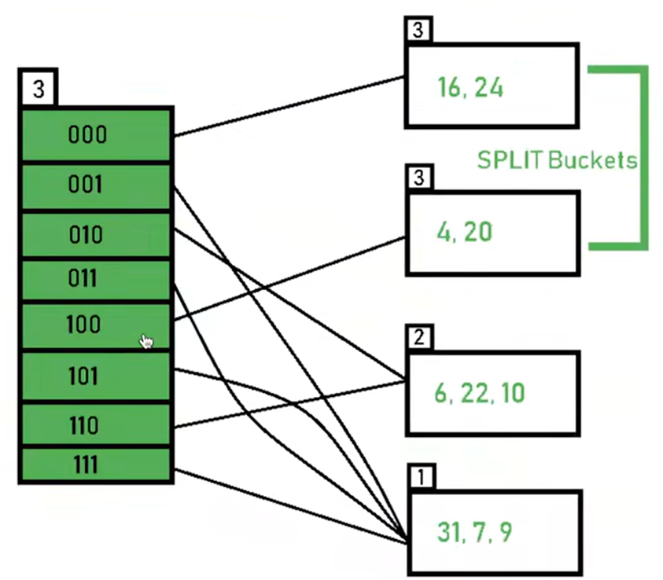

# 关系型数据库文件格式

数据库系统将文件视为page的集合，根据其自己的策略管理对page的读写，进而优化page的空间利用率和局部性。page是一个固定大小的数据块，数据内容可以是tuple、metadata、索引、日志······每个page根据存储内容不同可以分为不同的page类型，并且大部署数据库系统为每个page跟配了一个唯一的id，并使用某种映射将page id映射到具体的物理存储位置。

一些数据库系统要求page应该是self-contained

文件中page的组织方式：

1. heap file organization
2. 序列化文件 organization
3. hash文件 organization

## page格式

header通常包含的metadata有：

- page size
- checksum
- DBMS version
- transaction visibility
- compression information

page内存储records有两种类型：

1. tuple-oriented
2. log structure

### tuple-oriented--slotted pages

在page内使用十一个array保存每条record的位置和size，array从低offset向高offset增加；record存储从过年高offset向低offset增加。

### log-structured

在page中存储操作日志，根据日志重新构建数据。此结构的兴起源于当前某些系统是append-only的，适合此种文件格式。

# Buffer Pool

## 目标

负责数据在磁盘和内存之间的传输。

Buffer Pool的总体设计目标是：

1. 优化空间局部性，使得磁盘是尽可能的顺序读/写
2. 时间控制：尽量减少硬盘读写等待，这需要控制page的读入时机和evict时机

当使用了buffer pool时，除PostgresQL，大部分数据库系统在使用文件系统接口时都会使用O_DIRECT标记来跳过文件系统的page cache。原因是：

1. 如果同时存在buffer pool+page cache，在内存中就存在冗余的page copy
2. 不同的OS采用不同的套题啊策略，在不同的OS上会有不同的性能表现

## 概念

buffer pool是数据库系统向OS申请的一块内存空间，数据库系统将这个空间以frame为单位进行划分管理。frame对应文件中的page，其大小是相等的。数据库将通过系统调用，将数据从存储设备拷贝到frame中，其直接拷贝而不会进行例如解压缩等操作，也就是说，frame中的字节和存储设备上的字节是完全一样的。

数据库系统通过一个page table来映射page id（数据库通常会为每个page分配一个全局唯一的id）到buffer pool中的frame位置。当然，如果没有在page table中找到需要的page，说名page miss。page table中的每一个entry，通常包含的信息有：

1. page id与frame array的映射
2. dirty flag：表示此page是否在数据库系统中被修改
3. pin/reference counter：表示当前数据库系统中需要此page的thread/query的数量

## Buffer Pool通用优化技术

在Buffer Pool中可以根据数据库内核中的一些统计信息、query语句的执行计划来对buffer pool的行为进行优化，使得Buffer Pool能有更好的性能。在这个优化的过程中一般要考虑全局最优和局部最优的一个折衷。局部最优是指根据一个事务的上下文，对buffer pool进行frame调度，使得buffer pool对当前事务的性能最优。但是局部最优并不一定是全局最优的，全局最优是指buffer pool调度frame使得对所有事务的总体性能最优。

常有的优化技术有：

1. 多个buffer pool
2. pre-fetching
3. 共享磁盘IO
4. buffer pool bypass

### 多个buffer pool

如字面意思，在数据库系统中不是指维持一个buffer pool，而是维护多个buffer pool。每个buffer pool可以跟一个database或者page相关联，或者根据workloads的不同，使用不同的buffer pool。每个buffer pool可以根据其独自的情况使用不同的管理策略，这样的优点是：

1. 局部性提高
2. 减少了latch竞争（当有多个buffer pool时，有多个page table，多线程可以访问不同的page table，进而减少了latch竞争）

在多个buffer pool的情形下，数据库系统将page映射到某个buffer pool的方式有两种：

1. 建立一个buffer pool划分对象的id到buffer pool的映射表
2. hash（MySQL实现方式）

### pre-fetch

1. 空间局部性预取，减少随机IO（OS亦能完成）
2. 根据query的execution plan，预取其需要的page（OS无法完成）

### 共享磁盘IO

1. scan sharing1：buffer pool将多个query的读写请求batch起来，如果是读取相同的page，则可以共享IO的结果；另一方面可以重组IO顺序，可以减少磁头移动的时间。
2. scan sharing2：当query A的读取请求和已经在执行的query B的读取请求近似时，可以将A的cursor绑定到B的cursor，这样就共享了当前正在进行的磁盘IO，当B的IO结束后，数据库系统再将A还没有执行的IO继续执行，完成A的全部IO请求。（只有DB2和MSSQL支持，ORACAL只支持数据库完全一致IO情况下的cursor sharing）。另外关系模型的无序性导致一些查询可以从这个机制中获得额外的优化，例如limit 100。

### buffer pool bypass

此技术原理为，不将获取到的page数据存储到buffer pool中。因为有些query是查询大量数据但是只使用一次，如果放到buffer pool中会导致buffer pool被污染。也就是说当前query的局部性导致buffer pool的全局性受到大影响。

另外对当前query可以创建一个临时的buffer，当query执行结束后就删除这个临时buffer pool，适合于一些sorting，join等操作。

## Buffer置换策略

### LRU

LRU 算法的设计原则是：如果一个数据在最近一段时间没有被访问到，那么在将来它被访问的可能性也很小。也就是说，当限定的空间已存满数据时，应当把最久没有被访问到的数据淘汰。

如果每次找最久未使用的页面对于性能的开销是很大的。

### CLOCK

近似 LRU 算法，但是不需要每页独立的时间戳。

* 每页有一个 reference 位
* 当页面时可获取的，设置为 1

**CLOCK 与 LRU 是不能应对sequential flooding的情形。**

### LRU-K

LRU-K Replacer 用于存储 buffer pool 中 page 被引用的记录，并根据引用记录来选出在 buffer pool 满时需要被驱逐的 page。

在**普通的 LRU** 中，我们**仅需记录 page 最近一次被引用的时间**，在驱逐时，**选择最近一次引用时间最早**的 page。

LRU-K的主要目的是为了解决LRU算法“缓存污染”的问题，其核心思想是将“最近使用过1次”的判断标准扩展为“最近使用过K次”。

相比LRU，LRU-K 需要多维护一个队列，用于记录所有缓存数据被访问的历史。只有当数据的访问次数达到k次的时候，才将数据放入缓存。当需要淘汰数据时，LRU-K会淘汰第K次访问时间距当前时间最大的数据。

在 LRU-K 中，我们需要记录 page 最近 K 次被引用的时间。假如 list 中所有 page 都被引用了大于等于 K 次，则比较最近第 K 次被引用的时间，驱逐最早的。假如 list 中存在引用次数少于 K 次的 page，则将这些 page 挑选出来，用普通的 LRU 来比较这些 page 第一次被引用的时间，驱逐最早的。

另外还需要注意一点，LRU-K Replacer 中的 page 有一个 evictable 属性，当一个 page 的 evicitable 为 false 时，上述算法跳过此 page 即可。这里主要是为了上层调用者可以 pin 住一个 page，对其进行一些读写操作，此时需要保证 page 驻留在内存中。

#### LRU-K Replacer Implementation

每个元素都需要一个标记`evictable`来判断元素是否可以被驱逐，如果为`false`，则代表元素无法被驱逐。因此我们需要设计一个结构`FrameEntry`来记录这类信息。

设计一个List作为`访问数据小于K`的`FrameEntry`存储，设计一个另一个List作为`访问数据大于等于K`的`FrameEntry`存储，再使用一个Map，key为`frame_id`，value为`FrameEntry`的指针地址。类似与LRU的实现思路，去实现LRU-K。

### LOCALIZATION

数据库系统根据每一个query或者事务的统计信息，在buffer pool中淘汰选择的page。

### PRIORITY HINTS

给page分配优先级，置换时考虑优先级。

## InnoDB 的具体解决方法

由上图可以看出 InnoDB 将 LRU List 分为两部分，默认前 5/8 为 New Sublist（新生代）用于存储经常被使用的热点数据页，后 3/8 为 Old Sublist（老生代），新读入的数据页默认被放到 Old Sublist 中，只有满足一定条件后，才会被移入 New Sublist。

新生代和老生代代比例在 MySQL 中通过参数 `innodb_old_blocks_pct` 控制，值的范围是5到95.默认值是37（即池的3/8）。

- 如果数据页真正被读取（预读成功），才会加入到新生代的头部
- 如果数据页没有被读取，则会比新生代里的“热数据页”更早被淘汰出缓冲池

改进版缓冲池LRU能够很好的解决“预读失败”的问题。但仍然无法解决缓冲池被污染但问题。

**解决方法**

缓冲池加入了一个“老生代停留时间窗口”的机制：

(a). 假设T=老生代停留时间窗口

(b). 插入老生代头部的页，即使立刻被访问，并不会立刻放入新生代头部

(c). 只有满足“被访问”并且“在老生代停留时间”大于T，才会被放入新生代头部

## Dirty Pages处理

在淘汰一个page时，如果一个page不是dirty page，则可以直接将此page从内存中移除，因为此page在内存中和disk中是一致的。如果此page是dirty page就需要将此page的数据更新到磁盘中。此时有两种解决方法：

1. 置换时写出。性能肯定很差，因为系统要等待磁盘IO完成
2. 后台写出。使用一个后台线程来周期性将dirtypage更新到磁盘上。需要注意dirty page写出时必须保证日志已经更新。

## Buffer Pool Manager Implementation

`BufferPoolManager`负责从`DiskManager`获取数据库页面并将它们存储在内存中。`BufferPoolManage`还可以在有要求它这样做时，或者当它需要驱逐一个页以便为新页腾出空间时，将脏页写入磁盘。为了确保您的实现能够正确地与系统的其余部分一起工作，我们将为您提供一些已经填写好的功能。您也不需要实现实际读写数据到磁盘的代码(在我们的实现中称为`DiskManager`)。我们将为您提供这一功能。

系统中的所有内存页面均由`Page`对象表示。`BufferPoolManager`不需要了解这些页面的内容。 但是，作为系统开发人员，重要的是要了解`Page`对象只是缓冲池中用于存储内存的容器，因此并不特定于唯一页面。 也就是说，每个`Page`对象都包含一块内存，`DiskManager`会将其用作复制从磁盘读取的物理页面内容的位置。 `BufferPoolManager`将在将其来回移动到磁盘时重用相同的Page对象来存储数据。 这意味着在系统的整个生命周期中，相同的`Page`对象可能包含不同的物理页面。`Page`对象的标识符（`page_id`）跟踪其包含的物理页面。 如果`Page`对象不包含物理页面，则必须将其`page_id`设置为`INVALID_PAGE_ID`。

每个Page对象还维护一个计数器，以显示“固定”该页面的线程数。`BufferPoolManager`不允许释放固定的页面。每个`Page`对象还跟踪它的脏标记。您的工作是判断页面在解绑定之前是否已经被修改（修改则把脏标记置为1）。`BufferPoolManager`必须将脏页的内容写回磁盘，然后才能重用该对象。

`BufferPoolManager`实现将使用在此分配的前面步骤中创建的`LRUKReplacer`类。它将使用`LRUReplacer`来跟踪何时访问页对象，以便在必须释放一个帧以为从磁盘复制新的物理页腾出空间时，它可以决定取消哪个页对象

你需要实现在(`src/buffer/buffer_pool_manager.cpp`):的以下函数

- `FetchPageImpl(page_id)`
- `NewPageImpl(page_id)`
- `UnpinPageImpl(page_id, is_dirty)`
- `FlushPageImpl(page_id)`
- `DeletePageImpl(page_id)`
- `FlushAllPagesImpl()`

Buffer Pool Manager 里有几个重要的成员：

- pages：buffer pool 中缓存 pages 的指针数组
- disk_manager：框架提供，可以用来读取 disk 上指定 page id 的 page 数据，或者向 disk 上给定 page id 对应的 page 里写入数据
- page_table：刚才实现的 Extendible Hash Table，用来将 page id 映射到 frame id，即 page 在 buffer pool 中的位置
- replacer：刚才实现的 LRU-K Replacer，在需要驱逐 page 腾出空间时，告诉我们应该驱逐哪个 page
- free_list：空闲的 frame 列表

# 用于检索的数据结构

## Hash Table

哈希表即将数据key通过哈希函数映射到一个特定array的offset上。Hash Table的设计包含两个部分：

1. hash function
2. hash schema

### 哈希函数

常用的hash库有：

- CRC-64 (1975)
- MurmurHash (2008)
- Google CityHash (2011)
- Facebook XXHash (2012)
- Google FarmHash (2014)

### 静态Hash Table

静态意味hash表的大小是固定的，不会动态的resize。其需要对所存储的数据量有一个大致的假设。常用的静态Hash schema有：

1. Linear Probe Hashing，当hash冲突时，就顺序向下探测空位置插入
2. Robin Hood Hashing，在linear probe的基础上，对每一个entry维护一个距离其原始hash值的offset。steal space的思想。
3. Cuckoo Hashing，使用两个hash table，每个使用不同的hash函数，当有hash冲突时，依次移动，寻找空位。

解决非唯一键值的方法：

1. 分割的linked list，即hash表中的存储的value是一个linked list的起始，所有相同键值的存储早这个linked list中
2. 直接在hash table中存储重复的键值

### 动态Hash Table

区别于静态Hash Table，动态Hash Table机制中，不需要对存储的数据量有评估，动态Hash Table会根据存储的数据量大小，动态的扩容/缩容。三种经典的动态Hash Table模式：

1. Chained Hashing，hash的结果是bucket的编号，每个bucket是一个linked list。

   

2. Extendible Hashing，对chained hashing中的bucket进行reshuffling，多个slot可以指向同一个bucket

> 当 global 为 2时，bucket满了，则需要修改 global 为 3，进行reshuffling

3. Linear Hashing，维护一个指针指向下一个将要 spilt 的bucket。

### Extendible Hash Table

这个哈希表在 Buffer Pool Manager 中主要用来存储 buffer pool 中 page id 和 frame id 的映射关系。

Extendible Hash Table 由一个 directory 和多个 bucket 组成。

- **directory**: 存放指向 bucket 的指针，是一个数组。用于寻找 key 对应 value 所在的 bucket。
- **bucket**: 存放 value，是一个链表。一个 bucket 可以至多存放指定数量的 value。

Extendible Hash Table 与 Chained Hash Table 最大的区别是，Extendible Hash 中，不同的指针可以指向同一个 bucket，而 Chained Hash 中每个指针对应一个 bucket。

发生冲突时，Chained Hash 简单地将新的 value 追加到其 key 对应 bucket 链表的最后，也就是说 Chained Hash 的 bucket 没有容量上限。而 Extendible Hash 中，如果 bucket 到达容量上限，则对桶会进行一次 split 操作。

#### 样例

设定，桶大小为3 (假设)。

哈希函数：假设全局深度是 X，那么哈希函数返回 X 的最低位。

* **首先初始化**，全局深度 global-depth 和 local-depth 总是为1。

* **插入 16**，其二进制形式是 10000，且全局深度是1。哈希函数返回1000**0**最低1位为0。因此，16映射到目录的`id=0`。

* **插入4和6**：4（10**0**）和 6 (11**0**)的最低位都是0。因此，它们的哈希结果如下：

* **插入22**：其二进制形式是1011**0**。它的最低位是0。目录0指向的桶已经满了，发生了移除。

溢出时我们需要根据如下过程：

* 由于局部深度=全局深度，因此我们执行 bucket split 和 directory expansion。同时，分裂之后再溢出的桶中重新哈希数值。并且因为全局深度增加1，所以全局深度也是2。因此16,4,6,22倍重新哈希为最低2位。[16(100**00**), 4(1**00**), 6(1**10**), 22(101**10**)]

> 注意，未溢出的桶扔没有触及。但是因为目录的数量已经翻倍，现在又2个目录01和11指向了同一个桶。这是因为桶的局部深度保持为1。并且任何局部深度小于全局深度的桶会被不止一个目录指向。

* **插入24和10**：24（110**00**）和 10（10**10**）基于目录 id 00 和 10 可以被哈希。此处，没有遇到溢出的情况。

  

* **插入20**：元素20（101**00**）时再一次遇到溢出问题。

  

  发生桶分裂和目录扩张。

  

* **插入26**

  

  由于局部深度小于全局深度（2 < 3），目录不会翻倍，仅仅进行桶分裂和分裂的桶元素重新哈希。最后，哈希给定数值列表的结果已经获得。

最后，这11个元素插入成功完成。

#### Extendible Hash Table Implementation

Extendible Hash Table 是要保证线程安全的。实际上应该是整个 table 一把大锁，再分区加多把小锁，或者更简单的做法，每个 bucket 一把小锁。均使用读写锁。

## Tree Indixes

数据库常用的树索引结构是B+ tree，是B-tree族中的一个，其余的还有：

- B-tree
- B*tree
- Blink tree(Paper: Efficient Locking for Concurrent Operations on B-Trees)

B+tree是一个M路的平衡树，是一种针对大block数据IO系统的优化方式，其搜索、序列访问、插入和删除的代价都是O(logn). B+tree中的每个节点除了root节点都是至少半满的（ [M/2-1, M-1] ）,每个内部节点有k个key以及k+1个非null的子节点。

# 索引并发控制

多线程的数据安全、正确主要有两个部分：

1. 逻辑数据正确性：事务、线程视角的获取的数据应该是按照数据库隔离级别正确获取的数据。常使用锁概念来保证
2. 物理数据正确性：实际在操作内存、磁盘数据时的安全一致操作，常使用latch概念来保证

Lock用于隔离不同的事务，保护逻辑上的数据库数据。类型有共享锁、互斥锁、Update、意向锁。有专门的锁管理器，其会进行死锁检测和死锁恢复，常用的手段有waits-for、timeout、abort。

Latch用于隔离线程间对内存数据的访问。只有两种类型的latch：read latch于write latch。latch没有死锁检测和死锁恢复模块，依靠编程人员的规范性来避免死锁。

Latch的实现方式：

1. mutex
2. Test-and-Set Spin Latch，需要现代CPU支持
3. Read-Writer Latch, 需要良好实现的队列管理

### Hash Table Latch

hash table操作都是一个方向的操作（hash->寻址->操作），因此是不会出现死锁的。
 锁的粒度有：

1. page粒度的latch
2. slot粒度的latch

### B+Tree Latch

B+树主要解决两个问题：

1. 并发的多线程访问
2. 保证一个线程来叶节点时，其余现在在merge/split时的安全性

# 排序和聚集

## 查询计划

在树中这个操作被重排（优化器）

## EXTERNAL MERGE SORT

## AGGREGATIONS

两种实现选择：

* Sorting
* Hashing

